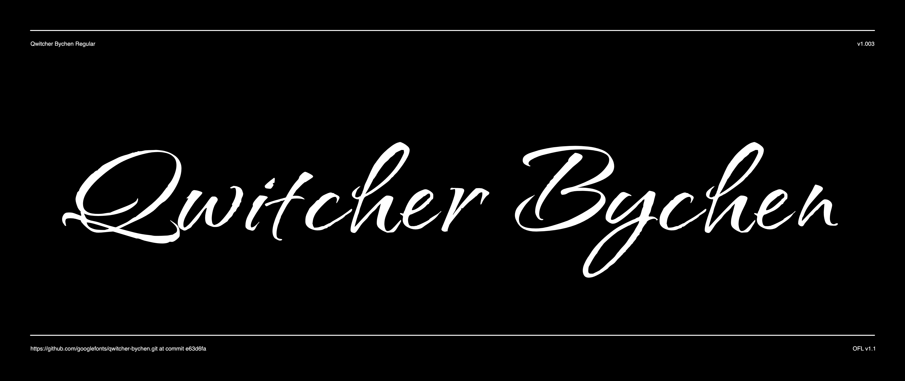

# Qwitcher Grypen

Inspired by the letterforms that come from using an architectural ruling pen, Qwitcher Grypen is a casual brush script with a bit of an edge.

It comes in two styles, Regular and Bold, with Latin Character sets including Western, Central, and Vietnamese language support.



## Building the Fonts

The font is built using fontmake and gftools post processing script. Tools are all python based, so it must be previously installed.

To install all the Python tools into a virtualenv, do the following:

From terminal:

```

cd your/local/project/directory

#once in the project folder create a virtual environment. 
This step has to be done just once, the first time:

python3 -m venv venv

#activate the virtual environment

source venv/bin/activate

#install the required dependencies

pip install -r requirements.txt

```

Then run the this command:

```
cd sources
gftools builder config.yml
```
